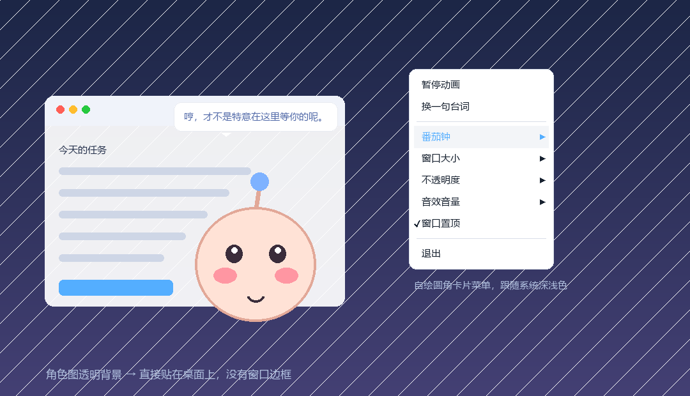
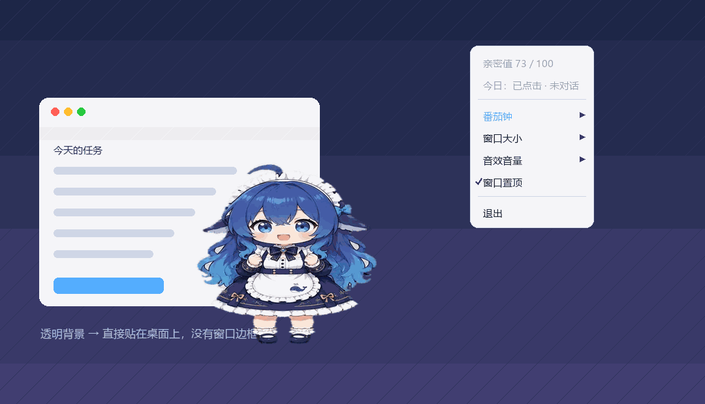

<div align="center">

# 🐾 桌面宠物小摆件

**一个纯 Python 的 Windows 桌面宠物：透明无边框、拖拽缩放、点击有弹性反馈和音效，还自带一个不卡界面的番茄钟。**

纯本地运行 · 不联网 · 无后端 · 单文件 · 零音频素材依赖



</div>

---

## ✨ 项目特点

### 1. 真·透明抠像，不脏边

用 `overrideredirect` + `-topmost` + `-transparentcolor` 做无边框键控透明窗口，而不是靠 `-alpha` 假装透明：

- **键控色自动挑选**：启动时扫描所有帧，从候选色里挑一个图片里**根本不存在**的颜色做键控色，不会误伤角色身上的像素
- **二值化 alpha**：缩放后把 alpha 阈值化再合成，所以半透明边缘不会留下键控色描边（这是这种做法最常见的翻车点）
- **Per-Monitor V2 DPI 感知**：高分屏下图像清晰、窗口坐标不漂移
- **透明区域自动鼠标穿透**：键控色的地方点得到桌面，不会挡着你干活

### 2. 动画 GIF 角色，一个变量换人

- 原生支持多帧 GIF，按每帧自带的 `duration` 循环播放（示例素材 99 帧 / 20ms）
- 任意尺寸缩放都用 LANCZOS 重采样，缩到 40% 或放到 130% 都不糊
- 换角色只需要改文件顶部一个 `IMAGE_PATH`，或者把图丢进 `assets/pet.gif`

### 3. 点击手感（这个项目的重头戏）

不是简单的"点一下播放个动画"，而是复刻了成熟桌面挂件的**两态弹簧**：

| 阶段 | 形变 | 参数 |
|---|---|---|
| 按下 | `scaleY(0.88) scaleX(1.05)` | 220ms `cubic-bezier(.34,1.56,.64,1)` |
| 松开 | 回到 `1 : 1` | 同一条曲线，带回弹过冲 |
| 原点 | `50% 100%` | 底部中心 —— 脚踩在地上压扁，不是原地缩放 |

实测（角色 240×240）：按下 250ms 后变成 **252×211**，松开后回到 **240×240**。

配套的**音效是两个**（按下 / 松开各一个），不是"点一下响一声"：按下时音高往下掉（760→360Hz），松开时往上弹（420→980Hz），听感上就是一次弹回去的动作。

### 4. 番茄钟：PySide6 的 QTimer 和 Tkinter 共存

这个程序主体是 Tkinter，但番茄钟按要求用 **PySide6 的 `QTimer`** 驱动倒计时。两个框架各有各的事件循环，硬拼会互相饿死，这里的做法是：

> **Qt 事件循环不自己跑**，而是由 Tk 的 `after` 每 30ms 调一次 `QCoreApplication.processEvents()` 带着它走。
> 单线程、没有跨线程锁、谁都不阻塞谁。

- **绝不卡界面**：倒计时期间界面心跳实测 15 秒内 245 次，全程正常响应
- **不累积误差**：用 `remaining -= (now - last)` 按真实时间差推进，定时器迟到或抖动都不会让倒计时跑偏
- **没装 PySide6 也能用**：番茄钟菜单项自动变灰，其余功能照常

倒计时显示在头顶气泡里（`🍅 专注中 24:59`），**常驻不消失**直到时间结束：

```
点气泡         → 不动，仍是剩余时间
点角色         → 只弹不换词（换词会顶掉倒计时）
菜单换台词     → 番茄钟期间直接变灰
拖动 / 改大小  → 气泡跟着重新贴回头顶
到点           → 10 秒提示音 + "时间到啦"，然后自动收起
```

### 5. 完全自绘的卡片菜单

Tk 原生菜单没法做圆角，所以菜单是**自己用 PIL 画出来的圆角卡片**：

- 圆角 12、行高 34、悬停高亮条、子菜单箭头（多边形画，不依赖字体字形）
- **跟随系统深浅色**：读注册表 `AppsUseLightTheme` 自动切换配色
- 勾选态用折线画对勾（第一版用 `✓` 字符，结果微软雅黑缺字渲染成方框，已改掉）
- 子菜单展开时父行保持高亮；点击面板外或按 `Esc` 关闭
- 用全局抓取（`grab_set_global`）实现"点外面关闭"，和原生菜单行为一致

### 6. 会躲屏幕边的头顶气泡

- 在**角色实际像素**的头顶居中弹出（不是窗口顶部——算法取所有帧非透明区域的并集来定位）
- 圆角卡片 + 指向头顶的小尾巴；气泡被挤到屏幕边时，尾巴会自动偏移仍然指着角色
- 头顶放不下自动翻到角色下方（尾巴朝上），左右超出自动贴边
- 弹出动画：`scale .7 → 1` + 淡入 200ms；2.5 秒后淡出
- **点气泡换下一句台词**，连续点击不断刷新

### 7. 音效完全本地合成，零素材依赖

没有带任何 `.wav` / `.mp3`，三个音效都是**启动时用数学算出来**再写成 WAV 的：

- `press` 10KB / `release` 14KB：线性扫频 + 指数衰减包络 + 起手噪声瞬态
- `chime` 116KB：A5-C#6-E6 上行琶音，长衰减
- 合成总耗时 **56ms**，按当前音量生成对应版本并缓存
- 播放用标准库 `winsound`，**不需要 pygame / simpleaudio 之类的依赖**

菜单里可以直接调音量（0 / 25 / 50 / 75 / 100%），切换即时试听。

### 8. 状态自动记忆 + 干净退出

大小、不透明度、音量、屏幕位置都会存进 `pet_config.json`，下次打开回到原地。退出时依次撤销所有 `after` 定时器 → 停 Qt 定时器 → 停音效 → 存配置 → 销毁气泡和菜单 → 回收进程，不留后台残留。

---

## 📸 效果

<div align="center">



**点击时的压扁回弹 + 头顶气泡弹出**（演示用的是仓库自带的占位角色）

</div>

---

## 🚀 快速开始

```bash
git clone https://github.com/yum0ooo/anime-desk-pet.git
cd anime-desk-pet
pip install -r requirements.txt
python desktop_pet.py
```

仓库自带一个**占位角色**（`assets/pet.gif`，一只圆滚滚的小家伙，是本项目原创绘制、随 MIT 协议一起分发），所以 clone 下来直接就能跑。

想换成你自己的角色：把 GIF / PNG（需要透明背景）覆盖 `assets/pet.gif`，或者改 `desktop_pet.py` 顶部的 `IMAGE_PATH`。

**想要桌面快捷方式**（双击即用、不弹黑框）：

```powershell
.\install.ps1
```

脚本会自动找到 `pythonw.exe`、在桌面创建快捷方式、顺手检查依赖是否齐全。卸载：`.\install.ps1 -Uninstall`。

---

## 🎮 使用说明

| 操作 | 效果 |
|---|---|
| 左键拖动 | 把角色拖到任意位置（位移 < 4px 才算点击，不会误拖） |
| 单击角色 | 按下压扁 → 松开回弹 + 两个音效；头顶弹出随机台词 |
| 单击气泡 | 换下一句台词 |
| 右键角色 | 打开卡片菜单 |
| 滚轮 | 缩放角色 |
| Ctrl + 滚轮 | 调不透明度 |
| `Esc` | 退出 |

**右键菜单**：`暂停动画 / 换一句台词 / 番茄钟▸ / 窗口大小▸ / 不透明度▸ / 音效音量▸ / 窗口置顶 / 退出`

其中「暂停动画」会**定格在人物重心的居中帧**，并且把后台动画定时器一并停掉（不是空转），再点一次继续。

---

## ⚙️ 配置

所有可调项都写在 `desktop_pet.py` 顶部，改完保存重启即可：

```python
IMAGE_PATH = ...               # 角色图片（也可以用环境变量 DESKTOP_PET_IMAGE 覆盖）
BUBBLE_MS = 2500               # 气泡停留时间
POMODORO_MINUTES = 25          # 番茄钟时长（分钟）
ALARM_SECONDS = 10             # 到点提示音持续秒数
SOUND_VOLUME_DEFAULT = 65      # 默认音量
SQUISH_MS = 220                # 点击弹性时长
SQUISH_DOWN = (0.88, 1.05)     # 按下的压缩比例
LINES = [...]                  # 台词库
```

---

## 🧩 实现要点

| 问题 | 做法 |
|---|---|
| 透明窗口挡鼠标 | 键控色区域天然穿透，不用额外处理 |
| 气泡挡住角色 | 气泡窗口设 `WS_EX_TRANSPARENT`，鼠标事件直接穿过去 |
| 窗口尺寸 vs 角色尺寸 | 窗口尺寸 = 图片尺寸，所以角色永远不会被窗口裁掉 |
| 缩放时窗口乱跳 | 缩放以**底部中心**为锚点，像站在原地长高 |
| Tk 和 Qt 抢事件循环 | Qt 只当定时器用，由 Tk 的 `after` 泵 `processEvents()` |
| 定时器抖动累积 | 倒计时按 `time.monotonic()` 真实差值推进 |
| 相机/角色位置不同步 | 取全部帧非透明区域的**并集**来算头顶，动画中不抖动 |
| 中文字体没有 emoji | 🍅 用 Segoe UI Emoji 以 `embedded_color=True` 混排进气泡 |

代码规模：**1596 行 / 其中有效代码 1344 行**，单文件，无第三方 UI 框架。

启动耗时约 **0.5 秒**（Qt import 0.12s + 解码 99 帧 0.07s + 建窗口 0.31s）。

---

## ⚠️ 已知限制

- **仅 Windows**：键控透明、`winsound`、DPI 感知都用了 Win32 API
- 需要 **Python 3.9+**
- 菜单里的"窗口置顶"取消后，窗口会沉到其他窗口下面，需要右键菜单再打开（透明窗口没有任务栏图标可点，这是无边框的代价）
- 不透明度最低锁定在 20%，防止调太低之后找不到角色、也就调不回来了

---

## 🙏 致谢

UI 的视觉参数参考了下面两个开源项目，**代码全部是自己写的**，只借用了设计数值：

- [vladelaina/BongoCat](https://github.com/vladelaina/BongoCat) —— 自绘菜单的圆角/行高/间距/深浅色配色表、气泡卡片的圆角与描边规范
- [MeteorNOX/DeepSeek-Balance-Whale-Widget](https://github.com/MeteorNOX/DeepSeek-Balance-Whale-Widget) —— 点击弹性的 `scaleY(.88) scaleX(1.05)` / `transform-origin 50% 100%` / `.22s cubic-bezier(.34,1.56,.64,1)`，气泡的 `scale .7→1` 弹出方式与文字配色

音效没有使用上述项目的素材（其中包含 Minecraft 的版权音频），而是按同样的听感方向**本地重新合成**的。

---

## 📄 License

MIT —— 见 [LICENSE](LICENSE)。

仓库自带的 `assets/pet.gif` 是为演示原创绘制的占位角色，可随 MIT 协议自由使用（也可以用 `tools/make_placeholder.py` 重新生成）。
**换成你自己的角色图时，请确认你拥有那张图的版权。**

---

<div align="center">

## English

**A pure-Python Windows desktop pet**: frameless & truly transparent, draggable & resizable, with springy click feedback, synthesized sound effects, and a built-in pomodoro timer that never freezes the UI.

**Highlights**

- **Real transparency** — color-key window (`-transparentcolor`) with an auto-picked key color and binarized alpha, so there is never a key-color fringe around the sprite. Transparent areas are click-through.
- **Animated GIF sprite** — multi-frame playback honoring per-frame duration, LANCZOS resampling at any scale, one variable to swap the character.
- **Springy click feel** — press squashes to `scaleY(.88) scaleX(1.05)` and release springs back, `220ms cubic-bezier(.34,1.56,.64,1)`, anchored at the bottom center. Two separate sounds for press and release.
- **Pomodoro on a PySide6 `QTimer`** — Qt's event loop is pumped from Tk's `after`, so both toolkits share one thread and neither blocks. Countdown is driven by real elapsed time, so timer jitter never accumulates. The head bubble turns into a persistent `🍅 Focusing 24:59` and never fights with other interactions.
- **Hand-drawn card menu** — rounded card, hover highlight, checkmarks, submenus, disabled hint rows, follows the system light/dark theme.
- **Zero audio assets** — all three sound effects are synthesized numerically at runtime (56ms) and played with the stdlib `winsound`.
- **Fully offline** — no backend, no network, no telemetry.

```bash
pip install -r requirements.txt
# put your own transparent GIF/PNG at assets/pet.gif
python desktop_pet.py
```

**Windows only · Python 3.9+ · MIT**

</div>
